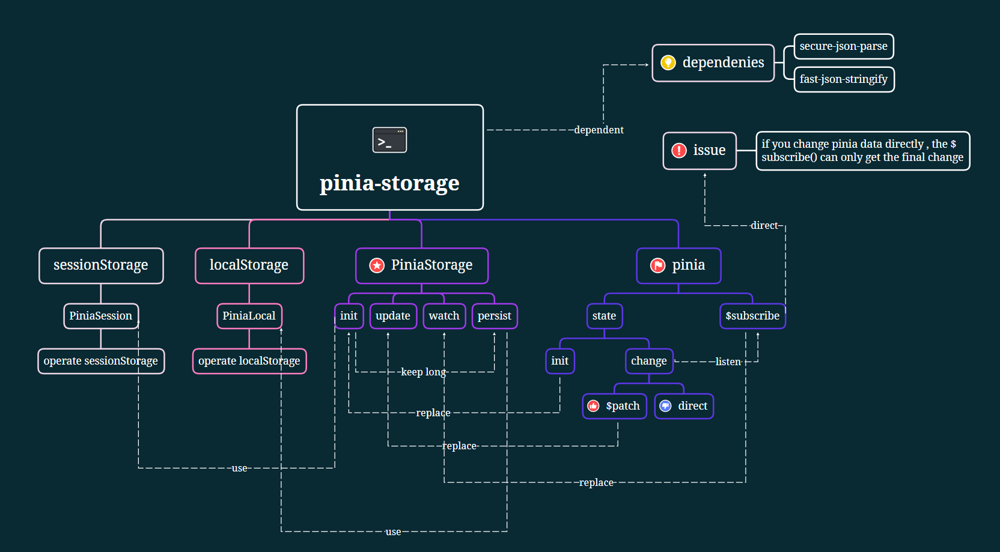

# README

<svg xmlns="http://www.w3.org/2000/svg" xmlns:xlink="http://www.w3.org/1999/xlink" width="122" height="20" role="img" aria-label="pinia-storage: 0.0.2"><title>pinia-storage: 0.0.2</title><linearGradient id="s" x2="0" y2="100%"><stop offset="0" stop-color="#bbb" stop-opacity=".1"/><stop offset="1" stop-opacity=".1"/></linearGradient><clipPath id="r"><rect width="122" height="20" rx="3" fill="#fff"/></clipPath><g clip-path="url(#r)"><rect width="83" height="20" fill="#555"/><rect x="83" width="39" height="20" fill="#fe7d37"/><rect width="122" height="20" fill="url(#s)"/></g><g fill="#fff" text-anchor="middle" font-family="Verdana,Geneva,DejaVu Sans,sans-serif" text-rendering="geometricPrecision" font-size="110"><text aria-hidden="true" x="425" y="150" fill="#010101" fill-opacity=".3" transform="scale(.1)" textLength="730">pinia-storage</text><text x="425" y="140" transform="scale(.1)" fill="#fff" textLength="730">pinia-storage</text><text aria-hidden="true" x="1015" y="150" fill="#010101" fill-opacity=".3" transform="scale(.1)" textLength="290">0.0.2</text><text x="1015" y="140" transform="scale(.1)" fill="#fff" textLength="290">0.0.2</text></g><script xmlns=""/></svg>

- author：syf20020816@outlook.com
- docName：pinia-storage README
- createDate：20230406
- updateDate：20230407
- version：0.0.2
- des-tag：正式版
- email：syf20020816@outlook.com

## pinia-storage Introduction

Pinia Storage is Pinia's persistence storage solution written in TypeScript. It can store the data in the state into localStorage and sessionStorage according to business requirements. It relies on the serialization scheme provided by the faster organization with better performance, greater scalability, and better flexibility: fast json stringify and deserialization scheme: secure json parse. Therefore, it is better than Pinia's persistence plug-in pinia plugin persist in performance. Similarly, users do not need to worry about how to store data. They only need to set the storage location when creating data, and the updated data will be automatically updated for storage.

Pinia-Storage是使用TypeScript编写的Pinia的持久化存储解决方案，可根据业务需求将state中的数据存储到localStorage和sessionStorage中，依赖于性能更好、扩展性更强、灵活度更好的fastify组织提供的序列化方案：fast-json-stringify和反序列化方案：secure-json-parse，因此在性能上强于pinia的持久化插件pinia-plugin-persist。同样用户无需关心如何进行存储，只需要在创建数据时设置存储位置即可，更新过的数据会自动更新存储。

> The average speed of updating and storing each data can reach 28-37ms, depending on your environment
>
> 平均每条数据更新存储的速度可以达到28~37ms，当然这取决于你的环境



## 版本更新说明(update introduction)

| 版本(version)         | 0.0.2        |
| --------------------- | ------------ |
| 版本说明(version tag) | 正式版 |
| 更新时间(update date) | 20230407  |
| 技术(technology)      | pinia+localStorage+sessionStorage+fast-json-stringify+secure-json-parse+ts |

可用版本(work version):
1. 0.0.2（20230406）

更新点(update points)：

1. 更新包结构(0.0.2)

## 安装(install)

### npm 安装（npm install）

```bash
npm i pinia-storage
//you should install it's dependies
npm i fast-json-stringify
npm i secure-json-parse
npm i pinia
```

## QuickStart

Usage and examples can be found in GitHub | Gitee for items prefixed with `pinia-storage-test`

使用方式以及示例可以查看GitHub|Gitee中以pinia-storage-test为前缀的项目

### create pinia

#### store/index

```typescript
//store/index.ts or index.js
import { createPinia } from "pinia";

export const pinia = createPinia();
```

#### store/indexPinia.ts

```typescript
import { defineStore } from "pinia";
import { PiniaStorage } from "pinia-storage/index";

interface User {
  userId: UserId;
  username: string;
  age: number;
}

type UserId = string | number;
/**
 * user's scheme
 * 请注意anyOf和oneOf会一定程度影响性能
 * $id:注意这个，建议一定要加上,pay attention on $id,it is important,and you should add this param
 * this param is typeof string you can use other way to create it(window.crypto.randomUUID())
 */
const userScheme = {
  $id: window.crypto.randomUUID(),
  title: "user",
  type: "object",
  properties: {
    userId: {
      anyOf: [
        {
          type: "string",
        },
        {
          type: "number",
        },
      ],
    },
    username: {
      type: "string",
    },
    age: {
      type: "number",
    },
  },
};
//new PiniaStorage! in pinia it does not need param
const storage = new PiniaStorage();

export const indexStore = defineStore("index", {
  state: () => {
    return {
      id: 456,
      user: storage.init(
        "index",//this is pinia.$id
        "user",//This depends on your variable name!
        {
          userId: "1658ppo90",
          username: "pinia-storage",
          age: 16,
        },
        userScheme
      ) as User,
      test: storage.persist("index", "test", 56, {
        $id: window.crypto.randomUUID(),
        title: "test",
        type: "number",
      }),
    };
  },
});

```

#### store/indexPinia.js

```js
import { defineStore } from 'pinia'
import { PiniaStorage } from 'pinia-storage/pinia-storage'

/**
 * user's scheme
 * 请注意anyOf和oneOf会一定程度影响性能
 * $id:注意这个，建议一定要加上,pay attention on $id,it is important,and you should add this param
 * this param is typeof string you can use other way to create it(window.crypto.randomUUID())
 */
const userScheme = {
  $id: window.crypto.randomUUID(),
  title: 'user',
  type: 'object',
  properties: {
    userId: {
      anyOf: [
        {
          type: 'string'
        },
        {
          type: 'number'
        }
      ]
    },
    username: {
      type: 'string'
    },
    age: {
      type: 'number'
    }
  }
}
//new PiniaStorage! in pinia it does not need param
const storage = new PiniaStorage()

export const indexStore = defineStore('index', {
  state: () => {
    return {
      id: 456,
      user: storage.init(
        'index',
        'user',
        {
          userId: '1658ppo90',
          username: 'pinia-storage',
          age: 16
        },
        userScheme
      ),
      test: storage.persist('index', 'test', 56, {
        $id: window.crypto.randomUUID(),
        title: 'test',
        type: 'number'
      })
    }
  }
})

```

### main.ts | main.js

```typescript
import { createApp } from "vue";
import "./style.css";
import App from "./App.vue";
import { pinia } from "./store/index";

createApp(App).use(pinia).mount("#app");
```

### App.vue

``` html
<template>
  <div id="app">
    <div>
      <ul>
        <li>not use pinia-storage: {{ store.id }}</li>
        <li>use pinia-storage-session:{{ store.user.userId }}</li>
        <li>use pinia-storage-session:{{ store.user.username }}</li>
        <li>use pinia-storage-session:{{ store.user.age }}</li>
        <li>use pinia-storage-local:{{ store.test }}</li>
      </ul>
    </div>
    <button @click="change">change pinia state</button>
  </div>
</template>

<script lang="ts" setup>
import { ref, reactive, computed } from 'vue'
import { indexStore } from './store/indexPinia'
import { MutationType } from 'pinia'
import { PiniaStorage } from 'pinia-storage/index'
const store = indexStore()
//init PiniaStorage
const storage = new PiniaStorage(store)
//update data
//we should use try...catch
const change = () => {
  try {
     //update date core == pinia.$patch(state=>{...})
    storage.update((state: any) => {
      state.user.age++
      state.test += 5
    })
  } catch (error) {
    console.log('====state.id not define to use pinia-storage====')
  }
  store.id++
}
//subscribe the update!
storage.watch()
</script>

<style lang="scss" scoped>
</style>
```

## Why do not use JSON.stringify

The performance of using `JSON. stringify()`mainly depends on the size and structure of the serialized object, as well as the hardware configuration of the machine. Generally speaking, serializing a small simple object may not have significant performance issues, but handling large and complex objects may lead to performance issues.
The following are some factors that may affect the performance of `JSON. stringify()`:

- Object size and depth: The larger the object, the longer the serialization time required.
- Object structure: If the object structure is too complex, such as containing circular references or nested objects, it can also lead to serialization performance issues.
- Hardware and browser performance.

Overall, if you need to serialize large or complex objects, you should try to avoid calling 'JSON. stringify()' frequently, cache the serialization results as much as possible, and avoid duplicate serialization.

使用 `JSON.stringify()` 的性能主要取决于被序列化对象的大小和结构，以及机器的硬件配置。一般来说，序列化一个小型简单对象的性能不会有太大的问题，但是处理大型复杂对象时可能会导致性能问题。
以下是一些可能影响 `JSON.stringify()` 性能的因素：

- 对象的大小和深度：对象越大，序列化所需的时间就越长。
- 对象的结构：对象结构过于复杂，如包含循环引用或嵌套的对象，也会导致序列化的性能问题。
- 硬件和浏览器的性能。

总的来说，如果需要序列化大型或复杂对象，应该尽量避免频繁地调用 `JSON.stringify()`，尽可能缓存序列化结果，避免重复序列化。

